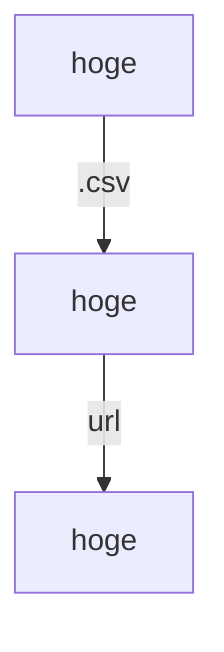

# # dotfiles
## || WHAT
`SSIA`

## || WHY
Save multiple dotfiles for use in daily work.

(盆栽を愛でたいお年頃...🍵)

## || How to use

<!--
https://docs.github.com/get-started/writing-on-github/working-with-advanced-formatting/creating-diagrams#creating-mermaid-diagrams
-->

## || REFERENCE
- [ドットファイル](https://wiki.archlinux.jp/index.php/%E3%83%89%E3%83%83%E3%83%88%E3%83%95%E3%82%A1%E3%82%A4%E3%83%AB) - Archlinux
- [vimrc読書会](https://vim-jp.org/reading-vimrc/) - vim-jp
- 

    
 🪴 companion plant 

    
        ※ いいな~と思った方々の個人的覚書
    
     - https://github.com/yutkat/dotfiles
     - https://github.com/mollifier/config
     - https://github.com/disk-inue/dotfiles
     - https://github.com/shiro/dotfiles
     - 
    
    

-  - 
